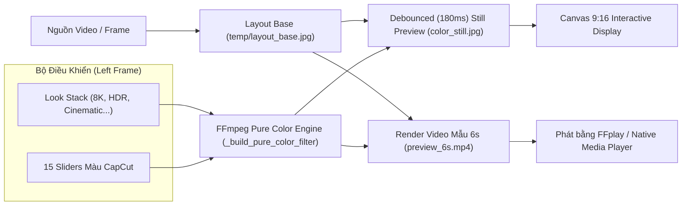
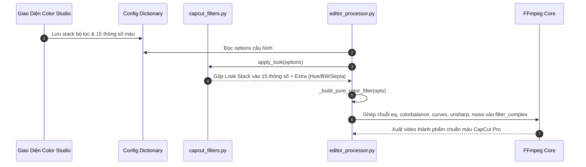

# 🎨 THIẾT KẾ KIẾN TRÚC & KỸ THUẬT: CAPCUT PRO COLOR GRADING & FILTER STUDIO

> **Mục tiêu**: Cung cấp tài liệu kỹ thuật toàn diện, giải thuật toán học FFmpeg và kiến trúc UI/UX của hệ thống **Bảng Màu & Bộ Lọc (CapCut Color Studio)** để bất kỳ dự án nào (như `v32_pro`) có thể tái lập và code lại chính xác 100% chuẩn chất lượng màu điện ảnh CapCut Pro.

---

## 📑 MỤC LỤC
1. [Kiến Trúc Tổng Quan (Architecture Overview)](#1-kiến-trúc-tổng-quan)
2. [Chi Tiết 15 Thông Số Màu & Giải Thuật Toán Học FFmpeg](#2-chi-tiết-15-thông-số-màu--giải-thuật-toán-học-ffmpeg)
3. [Cơ Chế Bộ Lọc Look & Xếp Chồng Nhiều Lớp (Look Stack Engine)](#3-cơ-chế-bộ-lọc-look--xếp-chồng-nhiều-lớp-look-stack-engine)
4. [Kiến Trúc Giao Diện UI & Đồng Bộ Hai Chiều (Slider + Spinbox Sync)](#4-kiến-trúc-giao-diện-ui--đồng-bộ-hai-chiều)
5. [Cơ Chế Live Preview 9:16 Siêu Tốc & Debounce (180ms)](#5-cơ-chế-live-preview-916-siêu-tốc--debounce)
6. [Render Video Mẫu 6s & Tích Hợp ffplay](#6-render-video-mẫu-6s--tích-hợp-ffplay)
7. [Lược Đồ Tích Hợp Vào Pipeline Render Tổng](#7-lược-đồ-tích-hợp-vào-pipeline-render-tổng)

---

## 1. KIẾN TRÚC TỔNG QUAN

Hệ thống Color Studio gồm 2 bảng chức năng chính:
- **Left Panel (Bộ Điều Khiển Màu Sắc & Filter Stack)**: Quản lý danh sách layer bộ lọc xếp chồng + 15 thanh trượt thông số màu gốc với khả năng đồng bộ 2 chiều (Slider $\leftrightarrow$ Spinbox).
- **Right Panel (Preview Canvas 9:16 & Video Mẫu)**: Hiển thị ngay lập tức kết quả đổ màu lên ảnh tĩnh của khung video và hỗ trợ render nhanh 6s để xem hiệu ứng chuyển động.



---

## 2. CHI TIẾT 15 THÔNG SỐ MÀU & GIẢI THUẬT TOÁN HỌC FFMPEG

Tất cả 15 thông số được xử lý qua chuỗi filter FFmpeg cực kỳ tối ưu, mô phỏng chuẩn xác thuật toán xử lý pixel của CapCut:

| STT | Tên Thông Số | Key Config | Khoảng Giá Trị | Filter FFmpeg & Công Thức Toán Học |
|:---:|:---|:---|:---:|:---|
| 1 | **Nhiệt độ (Temperature)** | `temperature` | `[-100, 100]` | `colorbalance=rh={temp/80}:bh={-temp/80}` (Tăng đỏ/giảm xanh dương khi ấm, ngược lại khi lạnh) |
| 2 | **Tông màu (Tint)** | `tint` | `[-100, 100]` | `colorbalance=gh={tint/80}` (Chỉnh sắc thái xanh lá / tím hồng) |
| 3 | **Độ bão hòa (Saturation)** | `saturation` | `[-100, 100]` | `eq=saturation={max(0, 1.0 + sat/25.0)}` (1.0 là gốc, tăng/giảm độ rực) |
| 4 | **Phơi sáng (Exposure)** | `exposure` | `[-100, 100]` | `eq=brightness={exposure/100.0}` (Tăng/giảm độ sáng tổng thể) |
| 5 | **Tương phản (Contrast)** | `contrast` | `[-100, 100]` | `eq=contrast={max(0, 1.0 + contrast/40.0)}` (Kéo giãn dải động sáng/tối) |
| 6 | **Vùng sáng (Highlights)** | `highlights` | `[-100, 100]` | `curves=all='0/0 0.25/p1_y 0.75/(0.75 + highlights/200.0) 1/1'` |
| 7 | **Bóng (Shadows)** | `shadows` | `[-100, 100]` | `curves=all='0/0 0.25/(0.25 + shadows/200.0) 0.75/p2_y 1/1'` |
| 8 | **Vùng trắng (Whites)** | `whites` | `[-100, 100]` | `curves=all='b_mod/0.0 0.5/0.5 {1.0 - whites/300.0}/1.0'` |
| 9 | **Vùng đen (Blacks)** | `blacks` | `[-100, 100]` | `curves=all='{blacks/300.0}/0.0 0.5/0.5 w_mod/1.0'` |
| 10 | **Độ chói (Brilliance)** | `brilliance` | `[-100, 100]` | `eq=gamma={max(0.1, 1.0 + brilliance/100.0)}` (Chỉnh phi tuyến gamma) |
| 11 | **Làm sắc nét (Sharpen)** | `sharpen` | `[0, 100]` | `unsharp=5:5:{sharpen*0.015}:5:5:0.0` (Lọc ma trận vùng cạnh biên) |
| 12 | **Độ rõ nét (Clarity)** | `clarity` | `[0, 100]` | `unsharp=9:9:{clarity*0.012}:9:9:0.0` (Tăng chi tiết tương phản mid-tones) |
| 13 | **Hạt nhỏ (Grain)** | `grain` | `[0, 100]` | `noise=alls={int(grain/100 * 40)}:allf=t+u` (Tạo hạt phim điện ảnh) |
| 14 | **Làm mờ (Blur)** | `blur` | `[0, 100]` | `gblur=sigma={max(1, int(blur/4))}` (Gaussian blur phủ toàn khung) |
| 15 | **Viền mờ dần (Vignette)**| `vignette` | `[0, 100]` | `vignette=PI/{0.4 + (100-vignette)/200.0}` (Tối 4 góc ống kính) |

---

## 3. CƠ CHẾ BỘ LỌC LOOK & XẾP CHỒNG NHIỀU LỚP (LOOK STACK ENGINE)

### 3.1. Danh Sách 17 Preset Look Điện Ảnh (CapCut Look Presets)
Hệ thống tích hợp 17 công thức màu chuẩn phong cách CapCut:
1. **8K**: `sharpen: 28, clarity: 22, contrast: 6, whites: 4` (Tăng tối đa độ nét viền, tạo cảm giác siêu phân giải).
2. **HDR**: `saturation: 12, contrast: 10, exposure: 3, highlights: 16, shadows: -8, whites: 8, blacks: 4, brilliance: 14` (Mở rộng dải sáng, màu nổi bật).
3. **Cinematic**: `temperature: -10, saturation: -12, contrast: 22, exposure: -4, highlights: -16, shadows: -14, blacks: 8, clarity: 18, grain: 14`.
4. **Teal Orange**: `temperature: 8, tint: -6, saturation: 10, contrast: 18, highlights: -8, shadows: -10, clarity: 12, hue: -8`.
5. **Vintage Film**: `temperature: 16, saturation: -18, contrast: -8, exposure: 4, highlights: 10, shadows: 8, whites: -12, grain: 28, sepia: 0.28`.
6. **Fade Soft**: `saturation: -20, contrast: -16, exposure: 6, highlights: 14, shadows: 16, blacks: -10, whites: -8`.
7. **Moody Dark**: `temperature: -12, saturation: -10, contrast: 16, exposure: -10, highlights: -20, shadows: -22, blacks: 16, clarity: 10, grain: 10`.
8. **Warm Golden**: `temperature: 28, tint: 6, saturation: 8, exposure: 4, highlights: 8, shadows: 4, brilliance: 8`.
9. **Cold Blue**: `temperature: -28, tint: -4, saturation: -6, contrast: 10, highlights: -8, shadows: -8`.
10. **Black & White**: `contrast: 18, highlights: -6, shadows: -8, clarity: 14, grain: 16, bw: 1.0`.
11. **Dreamy Soft**: `saturation: 6, exposure: 8, contrast: -10, highlights: 12, brilliance: 14`.
12. **Vibrant Punch**: `saturation: 28, contrast: 16, exposure: 4, clarity: 16, sharpen: 10, highlights: 6`.
13. **Night City**: `temperature: -18, saturation: 8, contrast: 20, exposure: -8, highlights: 10, shadows: -18, clarity: 14`.
14. **Sepia Classic**: `contrast: -4, exposure: 4, grain: 18, sepia: 0.55`.
15. **Bleach Bypass**: `saturation: -22, contrast: 28, highlights: 12, shadows: -16, clarity: 22, sharpen: 12, grain: 8`.
16. **Retro 80s**: `temperature: 10, saturation: 22, contrast: 12, tint: 8, highlights: 8, grain: 12, hue: 12`.
17. **Food Fresh**: `temperature: 10, saturation: 20, contrast: 10, exposure: 4, clarity: 18, sharpen: 8, highlights: 6`.

### 3.2. Thuật Toán Trộn Xếp Chồng (Layer Stacking & Blending)
Khi người dùng thêm nhiều lớp màu (Ví dụ: `8K 70%` + `HDR 50%`), thuật toán sẽ:
1. Duyệt qua từng layer trong stack: $factor = \frac{\text{intensity}}{100.0}$.
2. Cộng dồn tuyến tính vào các thanh trượt màu:
   $$\text{value}_{\text{key}} = \text{slider\_value}_{\text{key}} + \sum (\text{preset}_{\text{key}} \times factor)$$
3. Tích lũy các hiệu ứng nâng cao:
   - **Đổi tông dải màu (Hue Shift):** `hue=h={sum_hue}`
   - **Chuyển đơn sắc (Black & White Mixer):**
     $$c = 1.0 - bw, \quad g = \frac{bw}{3.0}$$
     `colorchannelmixer=rr=c+g:rg=g:rb=g:gr=g:gg=c+g:gb=g:br=g:bg=g:bb=c+g`
   - **Tông Sepia Cổ Điển:**
     `colorchannelmixer=rr=keep+0.393*s:rg=0.769*s:rb=0.189*s:gr=0.349*s:gg=keep+0.686*s:gb=0.168*s:br=0.272*s:bg=0.534*s:bb=keep+0.131*s`

---

## 4. KIẾN TRÚC GIAO DIỆN UI & ĐỒNG BỘ HAI CHIỀU

### 4.1. Cấu Trúc Khung Nhìn (Layout Hierarchy)
```
Toplevel Window: "Bảng màu + Bộ lọc — khung 9:16 như Hook Studio" (1240x880)
├── Left Frame (Tùy chỉnh màu sắc & bộ lọc)
│   ├── Filter Box: Combobox chọn Look, Spinbox Cường độ, Listbox hiển thị Stack, Nút ➕ Add / ✎ Cường độ / ➖ Xóa
│   ├── Canvas Container cuộn dọc (Scrollable Frame)
│   │   └── 15 dòng: Label + tk.Scale (Slider) + ttk.Spinbox (Nhập số)
│   └── Nút "💾 Lưu Cấu Hình Màu"
└── Right Frame (Preview trực quan & Render mẫu)
    ├── Interactive Canvas hiển thị ảnh tĩnh 9:16
    ├── Nguồn Video mẫu & Spinbox Thời điểm bắt đầu (giây)
    ├── Status Label báo trạng thái
    ├── Nút "▶ Render mẫu 6s"
    └── Nút "⏯ Phát clip 6s"
```

### 4.2. Cơ Chế Đồng Bộ Hai Chiều Giữa Slider và Spinbox (Bi-directional Binding)
```python
def bind_sync(scale_widget, spinbox_widget):
    # Khi kéo thanh trượt -> Cập nhật spinbox và kích hoạt refresh debounce
    scale_widget.config(command=lambda v: (spinbox_widget.set(int(float(v))), schedule_color_refresh()))
    # Khi bấm nút tăng giảm spinbox -> Cập nhật thanh trượt và kích hoạt refresh
    spinbox_widget.config(command=lambda: (scale_widget.set(float(spinbox_widget.get() or 0)), schedule_color_refresh()))
    # Khi gõ số và Enter trên spinbox -> Cập nhật thanh trượt và kích hoạt refresh
    spinbox_widget.bind("<Return>", lambda e: (scale_widget.set(float(spinbox_widget.get() or 0)), schedule_color_refresh()))
```

---

## 5. CƠ CHẾ LIVE PREVIEW 9:16 SIÊU TỐC & DEBOUNCE (180ms)

### 5.1. Hai Bước Render Tối Ưu Hóa (2-Stage Fast Pipeline)
Nếu mỗi lần kéo thanh trượt mà phải đọc lại file MP4 dài hàng GB từ ổ cứng thì UI sẽ bị đơ (lag). Vì vậy hệ thống chia làm 2 giai đoạn:
1. **Giai đoạn 1 - Trích xuất Layout Base (`layout_base.jpg`):**
   - Chỉ chạy 1 lần khi chọn video hoặc thay đổi giây bắt đầu.
   - Áp dụng các hiệu ứng khung layout 9:16 (Scale, Crop, Blur nền) nhưng **chưa áp dụng màu**.
   - Lưu ra ảnh tạm `temp/filter_preview/layout_base.jpg`.
2. **Giai đoạn 2 - Đổ màu siêu tốc (`color_still.jpg`):**
   - FFmpeg chỉ nhận input là file ảnh `layout_base.jpg` và áp dụng chuỗi `_build_pure_color_filter`.
   - Thời gian thực thi cực nhanh: **chỉ ~80ms - 120ms**.
   - Cập nhật thẳng ảnh lên `Canvas` Tkinter.

### 5.2. Thuật Toán Chống Nháy Lag (Debounce Timer 180ms)
```python
refresh_job = {"id": None}

def schedule_color_refresh():
    # Nếu người dùng đang kéo liên tục, hủy lệnh chờ trước đó
    if refresh_job["id"] is not None:
        try:
            popup.after_cancel(refresh_job["id"])
        except Exception:
            pass
    # Đặt lịch chạy sau 180ms kể từ lần chạm cuối cùng
    refresh_job["id"] = popup.after(180, apply_color_still)
```

---

## 6. RENDER VIDEO MẪU 6s & TÍCH HỢP FFPLAY

Để người dùng kiểm tra độ mượt mà của hiệu ứng hạt (grain), tương phản chuyển động và độ sắc nét khi video chạy:

### 6.1. Lệnh Render Mẫu 6s (FFmpeg)
```bash
ffmpeg -y -ss {sec} -i {v_path} -t 6 \
  -filter_complex "{vf_with_color};[vout]scale=540:960[outv]" \
  -map "[outv]" -c:v libx264 -preset veryfast -crf 22 -an temp/filter_preview/preview_6s.mp4
```

### 6.2. Trình Phát Xem Ngay (FFplay)
```python
# Gọi FFplay hiển thị cửa sổ phát gọn gàng đúng tỉ lệ 9:16 (360x640)
subprocess.Popen(["ffplay", "-autoexit", "-x", "360", "-y", "640", preview_mp4], creationflags=0x08000000)
```

---

## 7. LƯỢC ĐỒ TÍCH HỢP VÀO PIPELINE RENDER TỔNG

Khi xuất video hoàn chỉnh trong `editor_processor.py`, chuỗi màu được nhúng mượt mà vào luồng render:



---

## 💡 HƯỚNG DẪN BÀN GIAO CHO PROJECT V32_PRO

1. **File độc lập dùng chung:**
   - Copy `capcut_filters.py` vào thư mục gốc của `v32_pro`.
2. **File thực thi:**
   - Tích hợp hàm `_build_pure_color_filter(options)` vào class dựng video (`editor_processor.py` hoặc renderer tương ứng).
   - Nhúng hàm popup `open_capcut_color_popup()` vào giao diện chính để người dùng mở bảng chỉnh màu.
