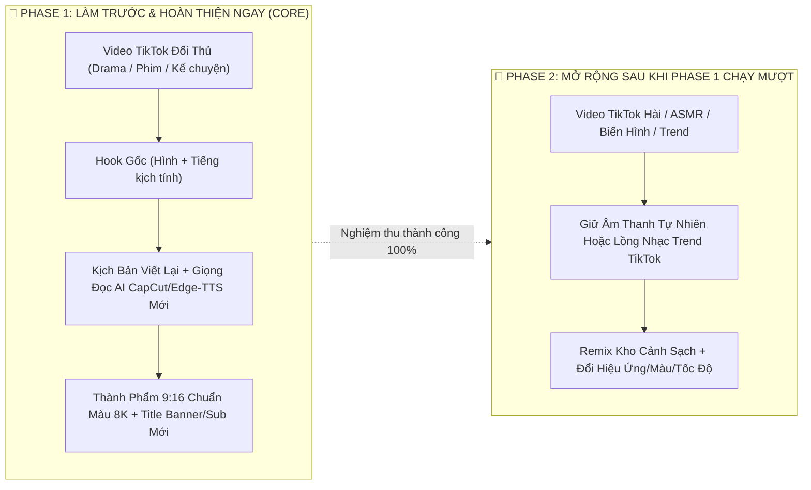
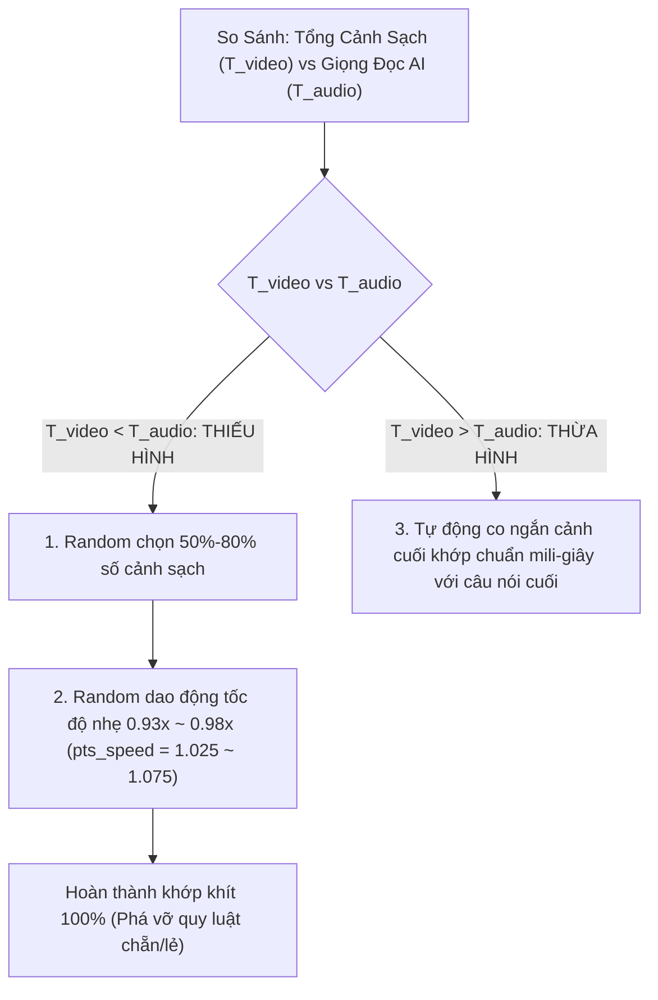
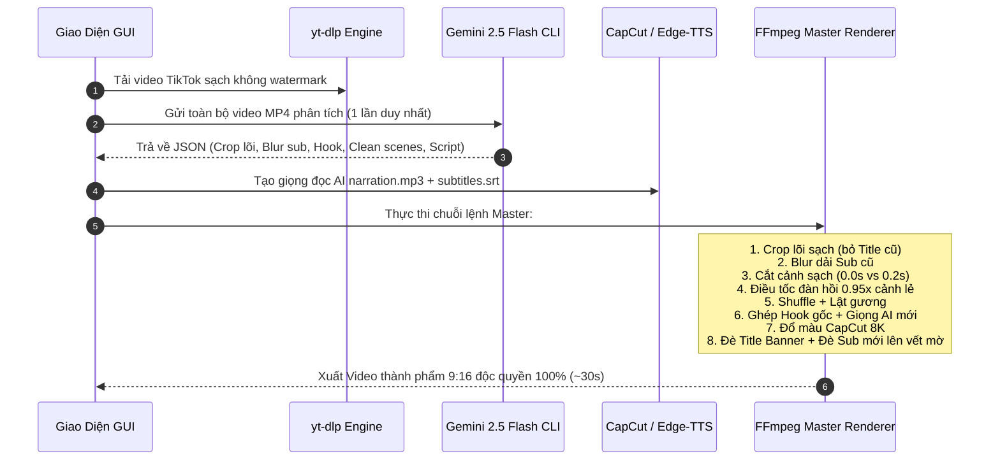

# 📱 MASTER PLAN: BIÊN TẬP & RE-MIX VIDEO TIKTOK ĐỐI THỦ (CHẾ ĐỘ 3 - TIKTOK SHORT REMIXER)

> **Tài liệu thiết kế kiến trúc kỹ thuật & giải thuật toàn diện 100%**  
> Dành cho việc phát triển và chuyển giao công nghệ cho hệ thống dựng video ngắn tự động độc quyền.

---

## 📑 MỤC LỤC
1. [Tầm Nhìn & Phân Kỳ Phát Triển (2-Phase Roadmap)](#1-tầm-nhìn--phân-kỳ-phát-triển)
2. [Chiến Lược Xử Lý Khung Hình & Tẩy Dấu Vết Đối Thủ (Ảnh 1 ➔ Ảnh 2 ➔ Thành Phẩm)](#2-chiến-lược-xử-lý-khung-hình--tẩy-dấu-vết-đối-thủ)
3. [Bộ Não Gemini CLI Đa Phương Thức (1 Lần Gọi Duy Nhất)](#3-bộ-não-gemini-cli-đa-phương-thức)
4. [Thuật Toán Cắt Chuyển Cảnh Thông Minh (Smart Transition Detection)](#4-thuật-toán-cắt-chuyển-cảnh-thông-minh)
5. [Giải Thuật Điều Tốc B-Roll Đàn Hồi (Khớp Khít Âm Thanh & Hình Ảnh)](#5-giải-thuật-điều-tốc-b-roll-đàn-hồi)
6. [Kỹ Thuật Đè Subtitle Mới Lên Đúng Vùng Sub Cũ Đã Blur](#6-kỹ-thuật-đè-subtitle-mới-lên-đúng-vùng-sub-cũ-đã-blur)
7. [Phân Hệ Tải Video TikTok Không Watermark (yt-dlp Engine)](#7-phân-hệ-tải-video-tiktok-không-watermark)
8. [Thiết Kế Giao Diện GUI Tinh Gọn (Giữ Lại, Lược Bỏ & Thêm Mới)](#8-thiết-kế-giao-diện-gui-tinh-gọn)
9. [Tổng Hợp Quy Trình Xử Lý Trong 1 Lệnh FFmpeg Master](#9-tổng-hợp-quy-trình-xử-lý-trong-1-lệnh-ffmpeg-master)

---

## 1. TẦM NHÌN & PHÂN KỲ PHÁT TRIỂN



---

## 2. CHIẾN LƯỢC XỬ LÝ KHUNG HÌNH & TẨY DẤU VẾT ĐỐI THỦ

```
[1. VIDEO GỐC ĐỐI THỦ (Ảnh 1 & 3)]         [2. LÕI VIDEO SẠCH (Ảnh 2)]          [3. THÀNH PHẨM 9:16 MỚI 100%]
┌──────────────────────────────┐              ┌──────────────────────────┐          ┌──────────────────────────┐
│ ░░ NỀN BLUR / TEXTURE TRÊN ░░│              │                          │          │ ┌──────────────────────┐ │
│ ┌──────────────────────────┐ │ ─── CẮT BỎ   │                          │          │ │ TITLE 2 DÒNG MỚI     │ │
│ │ TITLE IN TRÊN ĐẦU        │ │ ─── PHẦN NÀY │                          │          │ └──────────────────────┘ │
│ └──────────────────────────┘ │              │   LÕI HÌNH ẢNH NHÂN VẬT  │          │                          │
├──────────────────────────────┤              │     (KHÔNG CÒN TITLE)    │ ───────► │   LÕI VIDEO ĐÃ CẮT SẠCH  │
│                              │              │                          │          │   (Scale + Lật gương)    │
│    HÌNH ẢNH NHÂN VẬT CHÍNH   │ ─── GIỮ LẠI  │                          │          │                          │
│                              │              ├──────────────────────────┤          ├──────────────────────────┤
│                              │              │ ░░ [BLUR SUB: "OK"] ░░░░ │          │ █ SUBTIKTOK SLIM MỚI   █ │
├──────────────────────────────┤              │ ░░ [BLUR: "Part 2"] ░░░░ │          │ █ ĐÈ KÍN LÊN VẾT MỜ    █ │
│    [SUB CŨ: "THE COUNT OF"]  │ ─── BÔI MỜ   └──────────────────────────┘          │ └──────────────────────┘ │
│        [BADGE: "Part 2"]     │ ─── BÔI MỜ                                         └──────────────────────────┘
│ ░░ NỀN BLUR / TIKTOK UI DƯỚI ░│ ─── CẮT BỎ
└──────────────────────────────┘
```

1. **Cắt bỏ dải 2 đầu (Bỏ Title cũ):**
   - Áp dụng FFmpeg Crop cắt phăng toàn bộ phần nền mờ/texture ở trên chứa Title in chết của đối thủ.
   - Thu được **Lõi Video Sạch 100%** sắc nét như **Ảnh 2**.
2. **Bôi mờ dải Sub cũ & Badge Part cũ:**
   - Dùng sub-stream `boxblur=12:3` khoanh đúng dải đáy xuất hiện chữ Sub cũ (`OK`, `THE COUNT OF`) và badge `Part 2`.
3. **Đè Sub mới lên đúng vết mờ:**
   - Đặt Subtitle mới của mình đè chính xác lên dải vừa làm mờ, che phủ $100\%$ dấu vết cũ.

---

## 3. BỘ NÃO GEMINI CLI ĐA PHƯƠNG THỨC (1 LẦN GỌI DUY NHẤT)

Gửi trực tiếp video gốc (1–2 phút) vào Gemini CLI để AI "vừa làm đạo diễn hình ảnh vừa làm biên kịch" trong **1 lệnh gọi duy nhất (~15 giây)**:

```json
{
  "layout_geometry": {
    "has_top_title_or_blur": true,
    "core_crop_normalized": {
      "ymin": 0.16,
      "ymax": 0.84,
      "note": "Cắt bỏ 16% đỉnh trên chứa Title và 16% đáy dưới chứa UI, lấy lõi giữa như Ảnh 2"
    },
    "sub_blur_normalized": {
      "ymin": 0.74,
      "ymax": 0.86,
      "xmin": 0.10,
      "xmax": 0.90,
      "note": "Vùng chữ sub OK/The Count Of và badge Part 2 cần bôi mờ"
    }
  },
  "intro_outro_inspection": {
    "has_intro_tiktok_logo": false,
    "trim_start_sec": 0.0,
    "has_outro_tiktok_logo": true,
    "trim_end_sec": 0.6,
    "note": "Đoạn đầu là câu nói của Hook nên giữ nguyên 0.0s; đoạn cuối có logo TikTok giật nên cắt 0.6s"
  },
  "hook_analysis": {
    "has_hook": true,
    "start_sec": 0.0,
    "end_sec": 3.6,
    "keep_original_audio": true,
    "visual_summary": "Biểu cảm bất ngờ của nhân vật nữ rất kịch tính"
  },
  "scenes": [
    {
      "id": "S1",
      "clean_range": [3.6, 8.2],
      "visual_summary": "Chiếc xe thể thao màu đỏ tăng tốc trên cao tốc",
      "has_text": false,
      "transition_type": "none",
      "cutout_sec": 0.0
    },
    {
      "id": "S2",
      "clean_range": [8.2, 13.5],
      "visual_summary": "Cận cảnh đồng hồ tốc độ chạm vạch đỏ",
      "has_text": false,
      "transition_type": "white_flash",
      "cutout_sec": 0.18
    },
    {
      "id": "S3",
      "clean_range": [13.5, 18.78],
      "visual_summary": "Người lái xe mỉm cười tự tin nhìn gương chiếu hậu",
      "has_text": false,
      "transition_type": "none",
      "cutout_sec": 0.0
    }
  ],
  "remix_storyboard": [
    {
      "segment_index": 1,
      "scene_id": "S2",
      "narration_sentence": "Der Zeiger erreichte die absolute Höchstgrenze...",
      "target_duration_sec": 5.3
    },
    {
      "segment_index": 2,
      "scene_id": "S1",
      "narration_sentence": "Mit atemberaubender Geschwindigkeit raste der Wagen durch die finstere Nacht...",
      "target_duration_sec": 4.6
    },
    {
      "segment_index": 3,
      "scene_id": "S3",
      "narration_sentence": "Doch was er vorhatte, ahnte zu diesem Zeitpunkt noch absolut niemand.",
      "target_duration_sec": 5.3
    }
  ],
  "rewritten_narration": {
    "language": "de-DE",
    "title_line1": "DIE REAKTION WAR",
    "title_line2": "VÖLLIG UNERWARTET",
    "script_text": "Der Zeiger erreichte die absolute Höchstgrenze. Mit atemberaubender Geschwindigkeit raste der Wagen durch die finstere Nacht. Doch was er vorhatte, ahnte zu diesem Zeitpunkt noch absolut niemand."
  }
}
```

---

## 4. THUẬT TOÁN CẮT CHUYỂN CẢNH THÔNG MINH (SMART TRANSITION DETECTION)

Không cắt cứng cố định $0.5s$ để tránh làm cụt các cảnh ngắn ($1.5s - 2.0s$). Gemini CLI phân loại chính xác từng điểm nối:

| Loại Chuyển Cảnh | Nhận Diện Của AI | Cắt Bỏ (`cutout_sec`) | Xử Lý Thực Tế |
|:---|:---|:---:|:---|
| **Hard Cut (Cắt thẳng)** | Chuyển góc máy tức thì, không có hiệu ứng. | **`0.00s`** | **Giữ nguyên 100% độ dài cảnh**, không cắt bất kỳ mili-giây nào. |
| **White Flash (Chớp trắng)** | Màn hình sáng lóa trong 2-4 frame. | **`0.15s`** | Cắt bỏ đúng $0.15s$ vệt sáng tại điểm nối. |
| **Zoom Blur / Glitch** | Rung giật méo hình chuyển cảnh. | **`0.20s - 0.25s`** | Cắt bỏ vừa khít đoạn méo hình, giữ trọn chuyển động đẹp. |
| **Fade to Black (Mờ đen)** | Màn hình tối dần rồi sáng lại. | **`0.25s`** | Cắt bỏ phần tối đen chuyển tiếp. |

---

## 5. GIẢI THUẬT ĐIỀU TỐC B-ROLL ĐÀN HỒI NGẪU NHIÊN (STOCHASTIC ELASTIC SPEED)



1. **Khi THIẾU HÌNH ($T_{\text{video}} < T_{\text{audio}}$):**
   - **Xóa bỏ quy luật chẵn/lẻ cố định**: Hệ thống sử dụng `random.sample` chọn ngẫu nhiên một tập hợp $50\% - 80\%$ số cảnh.
   - **Random dao động tốc độ**: Tốc độ kéo dài trên mỗi cảnh được random vi mô trong dải an toàn tự nhiên $0.93x \sim 0.98x$ (`pts_speed = random.uniform(1.025, 1.075)`).
   - Mức giãn tốc độ này hoàn toàn nằm dưới ngưỡng cảm nhận của mắt người, nhưng tổng thể video nở ra khớp khít với âm thanh của giọng đọc AI.
2. **Khi THỪA HÌNH ($T_{\text{video}} > T_{\text{audio}}$):**
   - Tự động co ngắn đuôi cảnh cuối khớp khít câu kết thúc của giọng AI.

---

## 6. KỸ THUẬT ĐÈ SUBTITLE MỚI & LẬT GƯƠNG NGẪU NHIÊN BẢO VỆ CHỮ

1. **Lật Gương Phản Chiếu Ngẫu Nhiên (Randomized Asymmetric Mirroring)**:
   - Dựa trên cờ `has_text` do AI soi từng giây: Cảnh nào có chữ in/biển hiệu sẽ **tuyệt đối không lật gương** (tránh ngược chữ).
   - Các cảnh còn lại được chọn lật ngẫu nhiên độc lập $50\%$ (`random.random() < 0.5`), giúp mỗi video render ra có mẫu lật hoàn toàn khác nhau.
2. **Kỹ Thuật Đè Subtitle Lên Đúng Vùng Sub Cũ Đã Blur**:
   - Gemini CLI trả về tọa độ dải Sub cũ: $Y_{\text{sub}} = [0.74, 0.86]$.
   - FFmpeg bôi mờ (`boxblur=12:3`) dải chữ cũ này.
   - Tính toán lề đáy cho Sub mới: $\text{MarginV} = H_{\text{output}} \times (1.0 - Y_{\text{sub\_center}})$.
   - Đè Subtitle mới (kiểu TikTok Slim, viền đen dày $3\text{px}$, đổ bóng 3D) vào đúng tọa độ này, che kín $100\%$ vết mờ.
3. **Ghép Nối Các B-Roll Có Sẵn Theo Ngữ Nghĩa Gần Nhất (Nearest-Semantic Matching) & Sub Đọc Liên Tục**:
   - **Bản chất thực tế**: Video đối thủ chỉ có sẵn $N$ cảnh B-Roll tự nhiên (không có cảnh ngoại vi thay thế). Hệ thống giữ nguyên vẹn trọn vẹn từng cảnh, không cắt xén vụn vặt làm hỏng chuyển động gốc.
   - **Sub đọc liên tục (Continuous Narration)**: Giọng đọc AI đọc kịch bản một mạch liên tục, mượt mà từ đầu đến cuối như một người kể chuyện thực thụ, không bị ngắt gượng ép chờ chuyển cảnh. Subtitle xuất hiện đều đặn theo nhịp đọc.
   - **Cảnh chạy theo Sub**: Các cảnh B-Roll có sẵn được xếp lại trật tự theo nguyên tắc **ngữ nghĩa gần nhất** (cảnh nào thể hiện tâm trạng, hành động hoặc chi tiết sát nhất với đoạn sub tại thời điểm đó sẽ được ưu tiên xuất hiện).
   - Nhờ đó, người xem thấy câu chuyện kể trôi chảy liền mạch và hình ảnh bên dưới minh họa hợp lý, tự nhiên nhất có thể!

---

## 7. PHÂN HỆ TẢI VIDEO TIKTOK KHÔNG WATERMARK (YT-DLP ENGINE)

- Tích hợp lệnh `yt-dlp` trích xuất luồng API gốc của TikTok (`download_addr`), **không dính logo watermark mờ/nhấp nháy ở 4 góc**.
- Hỗ trợ link đầy đủ, link rút gọn (`vt.tiktok.com`), Reels, Shorts.
- **Kiểm tra 2 đầu thông minh bằng AI:** Gemini CLI tự xem 0.5s đầu và 1s cuối; nếu có logo TikTok giật thì mới cắt, nếu là nội dung thật thì **giữ nguyên $100\%$ ($0.0s$)**.

---

## 8. THIẾT KẾ GIAO DIỆN GUI TINH GỌN

```
┌──────────────────────────────────────────────────────────────────────────────────┐
│  TAB 1: NGUỒN & DỌN RÁC (CLEAN) │  TAB 2: AI & GIỌNG ĐỌC  │  TAB 3: RE-MIX & HẬU KỲ│
├──────────────────────────────────────────────────────────────────────────────────┤
│ [TAB 1: NGUỒN & DỌN RÁC]                                                         │
│  • Link TikTok / File MP4: [ https://vt.tiktok.com/ZS...            ] [📥 Tải/📁] │
│  • Thị trường đầu ra:      [ 🇩🇪 Đức — Deutsch ▼ ]  [✔] Tự đổi giọng đúng vùng    │
│  ──────────────────────────────────────────────────────────────────────────────  │
│  🛡️ TẨY DẤU VẾT ĐỐI THỦ (GEMINI CLI AUTO-CLEAN):                                 │
│  [✔] Tự động cắt 2 đầu (Bỏ Title cũ & Nền mờ ➔ Lấy Lõi Video Sạch Ảnh 2)        │
│  [✔] Tự động bôi mờ dải Sub cũ & Badge Part cũ    Độ mờ: [====●====] 75%         │
│  [✔] AI tự kiểm tra & cắt logo TikTok 2 đầu (0.0s nếu không có)                 │
├──────────────────────────────────────────────────────────────────────────────────┤
│ [TAB 2: AI & GIỌNG ĐỌC]                                                          │
│  [✔] Bật Giọng đọc AI (Thuyết minh kịch bản mới)                                 │
│  • Engine TTS: [ CapCut TTS ▼ ]    Vùng: [ de-DE ▼ ]   Giọng: [ Conrad (Nam) ▼ ] │
│  • Tốc độ đọc: [ +0% ▼ ]           [🔊 Nghe thử giọng]                            │
│  • Gemini Model: [ Google Antigravity (Gemini 2.5 Flash CLI) ▼ ]                 │
├──────────────────────────────────────────────────────────────────────────────────┤
│ [TAB 3: RE-MIX & HẬU KỲ]                                                         │
│  🎬 BỘ NÃO PHÂN TÁCH CẢNH THÔNG MINH:                                            │
│  [✔] Tách & Giữ lại đoạn Hook gốc mở đầu (Hình + Tiếng kịch tính)                │
│  [✔] Cắt bỏ chuyển cảnh rác (Flash/Zoom 0.15s - 0.25s / Hard Cut giữ 0.0s)       │
│  [✔] Điều tốc đàn hồi B-Roll (0.95x cảnh lẻ) khớp khít âm thanh                  │
│  ──────────────────────────────────────────────────────────────────────────────  │
│  🔀 CÔNG CỤ PHÁ MÃ BẢN QUYỀN (PIXEL ANTI-HASH):                                  │
│  [✔] Đảo trật tự cảnh b-roll hợp lý      [✔] Lật gương phản chiếu (hflip)        │
│  [✔] Đè Sub mới chính xác lên vùng Sub cũ đã Blur                                │
│  ──────────────────────────────────────────────────────────────────────────────  │
│  🎛️ BỘ 3 STUDIO CHUYÊN NGHIỆP:                                                  │
│  [ 🎨 Color (15 Màu CapCut + 17 Look) ]  [ 🔤 Title & Sub Studio ]  [ ✂ Crop Studio ]│
├──────────────────────────────────────────────────────────────────────────────────┤
│  CONFIG: [ test1 ▼ ] [💾 Lưu Config]                 [ 🚀 BẮT ĐẦU XỬ LÝ REMIX ]  │
└──────────────────────────────────────────────────────────────────────────────────┘
```

---

## 9. TỔNG HỢP QUY TRÌNH XỬ LÝ TRONG 1 LỆNH FFMPEG MASTER


