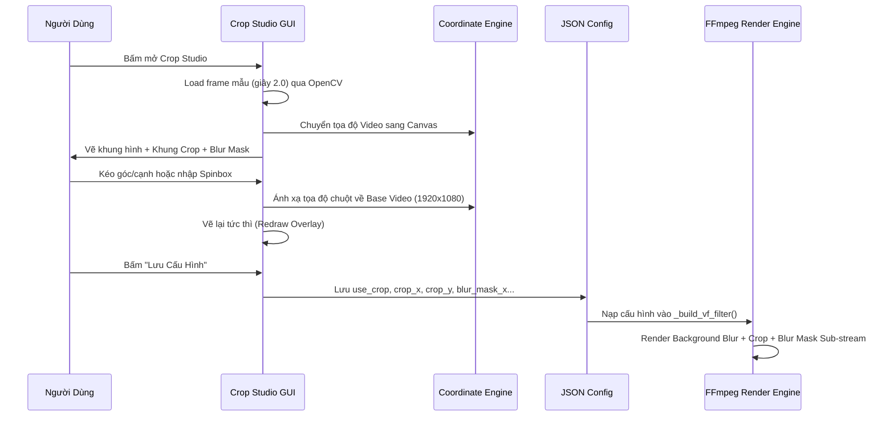

# BẢN THIẾT KẾ KỸ THUẬT CHI TIẾT (ENGINEERING BLUEPRINT)
# MODULE: CAPCUT PRO VIDEO CROP & BLUR MASK STUDIO
## (HỆ THỐNG CẮT XÉN & LÀM MỜ VÙNG CHỌN TƯƠNG TÁC TRỰC QUAN 2 CHIỀU)

---

## 1. TỔNG QUAN KIẾN TRÚC & GIAO DIỆN CROP STUDIO

Giao diện **CapCut Pro Video Crop Studio** được thiết kế dưới dạng cửa sổ Popup tương tác độc lập (Modal Window), chia làm 2 khu vực chức năng chính:

```
+-------------------------------------------------------------------------------------------------------+
|  CapCut Pro Video Crop Studio (Fixed Resolution Edition)                                            X |
+----------------------------------------------------+--------------------------------------------------+
|  [⚙ CẤU HÌNH & HỆ TỌA ĐỘ GỐC (BÊN TRÁI)]          |  [✂ PREVIEW & KÉO CO BÓP TRỰC QUAN (BÊN PHẢI)]   |
|                                                    |                                                  |
|  [x] Bật tính năng Cắt xén (Crop)                 |  +--------------------------------------------+  |
|  Tỷ lệ khung Crop: [ Tự do                 v ]    |  | ########################################## |  |
|  Chiều rộng gốc (W): [ 1920                ^v]    |  | ####### LỚP PHỦ MỜ (SHADED OVERLAY) ###### |  |
|  Chiều cao gốc (H):  [ 1080                ^v]    |  | ########################################## |  |
|  Tọa độ X (Trái):    [ 0                   ^v]    |  | ----[TL]---------[TOP]---------[TR]----    |  |
|  Tọa độ Y (Trên):    [ 0                   ^v]    |  | |                                     |    |  |
|                                                    |  | [L]     [KHUNG CROP VIỀN TRẮNG]       [R]   |  |
|  +--[ 🛡️ Làm mờ Vùng Chọn (Blur Mask) ]--------+  |  | |                                     |    |  |
|  | [x] Bật làm mờ 1 phần video                 |  |  | |   +-[BLUR MASK VIỀN CAM]-+          |    |  |
|  | Hình dạng: [ Hình chữ nhật             v ]  |  |  | |   |  (Che logo / sub cứng) |         |    |  |
|  | X: [ 20   ^v]  Y: [ 861  ^v]                |  |  | |   +----------------------+          |    |  |
|  | W: [ 932  ^v]  H: [ 210  ^v]                |  |  | ----[BL]-------[BOTTOM]--------[BR]----    |  |
|  +---------------------------------------------+  |  | ########################################## |  |
|                                                    |  +--------------------------------------------+  |
|  +--[ Thông tin quy chiếu ]--------------------+  |                                                  |
|  | Base Canvas: 1920 × 1080                    |  |                                                  |
|  | Crop: X=0, Y=0 | W=1920 × H=1080            |  |                                                  |
|  +---------------------------------------------+  |                                                  |
|                                                    |                                                  |
|  [ 🔄 Load lại khung hình ]                        |                                                  |
|  [ 📂 Tải ảnh mẫu từ máy... ]                      |                                                  |
|  [ ↩ Reset Crop ]                                 |                                                  |
|                                                    |                                                  |
|  [ 💾 Lưu Cấu Hình Cắt Xén & Làm Mờ ]             |                                                  |
+----------------------------------------------------+--------------------------------------------------+
```

---

## 2. CẤU TRÚC DỮ LIỆU CẤU HÌNH (CONFIG SCHEMA)

Mọi thông số được lưu đồng bộ trong file cấu hình JSON:

```json
{
  "use_crop": true,
  "crop_ratio": "Tự do",
  "base_w": 1920,
  "base_h": 1080,
  "crop_w": 1920,
  "crop_h": 1080,
  "crop_x": 0,
  "crop_y": 0,

  "use_blur_mask": true,
  "blur_shape": "Hình chữ nhật",
  "blur_mask_x": 20,
  "blur_mask_y": 861,
  "blur_mask_w": 932,
  "blur_mask_h": 210
}
```

---

## 3. HỆ QUY CHIẾU TỌA ĐỘ 2 CHIỀU (COORDINATE TRANSFORMATION)

### 3.1. Vấn đề cốt lõi
- Video gốc có độ phân giải cố định (ví dụ: $1920 \times 1080$, $1280 \times 720$, $3840 \times 2160$).
- Màn hình Canvas Tkinter có kích thước co dãn linh hoạt tùy theo độ phân giải màn hình người dùng (ví dụ: $800 \times 450$, $960 \times 540$).
- **Yêu cầu kỹ thuật**: Mọi thao tác kéo thả chuột trên Canvas phải ánh xạ chính xác tuyệt đối từng pixel về tọa độ gốc của video.

### 3.2. Thuật toán tính toán khung hiển thị (Aspect-Ratio Fitting)
```python
def calculate_display_size():
    cw = canvas.winfo_width()
    ch = canvas.winfo_height()
    bw, bh = base_w, base_h  # 1920, 1080
    video_ratio = bw / float(bh)
    aw, ah = max(100, cw - 20), max(100, ch - 20)

    if aw / float(ah) > video_ratio:
        disp_h = int(ah)
        disp_w = int(disp_h * video_ratio)
    else:
        disp_w = int(aw)
        disp_h = int(disp_w / video_ratio)

    image_offset_x = int((cw - disp_w) / 2)
    image_offset_y = int((ch - disp_h) / 2)
    return disp_w, disp_h, image_offset_x, image_offset_y
```

### 3.3. Ma trận biến đổi tọa độ qua lại (2-Way Mapping)

1. **Chuyển từ Tọa độ Video $\to$ Tọa độ Canvas (Để vẽ lên màn hình)**:
   $$\text{canvas\_x} = \text{offset\_x} + v_x \times \frac{\text{disp\_w}}{\text{base\_w}}$$
   $$\text{canvas\_y} = \text{offset\_y} + v_y \times \frac{\text{disp\_h}}{\text{base\_h}}$$

2. **Chuyển từ Tọa độ Chuột Canvas $\to$ Tọa độ Video (Khi người dùng kéo chuột)**:
   $$v_x = (c_x - \text{offset\_x}) \times \frac{\text{base\_w}}{\text{disp\_w}}$$
   $$v_y = (c_y - \text{offset\_y}) \times \frac{\text{base\_h}}{\text{disp\_h}}$$

---

## 4. THUẬT TOÁN TƯƠNG TÁC CHUỘT ĐA ĐIỂM (INTERACTIVE MOUSE ENGINE)

### 4.1. Nhận diện vị trí bấm chuột (`hit_test`)
Bán kính bắt dính chuột (`hit_tolerance = 14px`).

Hệ thống ưu tiên nhận diện theo thứ tự:
1. **4 Chốt góc của Blur Mask** (`blur_tl`, `blur_tr`, `blur_bl`, `blur_br`): Để co bóp vùng làm mờ.
2. **Thân hộp Blur Mask** (`move_blur`): Để di chuyển vùng làm mờ.
3. **4 Chốt góc của Khung Crop** (`tl`, `tr`, `bl`, `br`): Để co dãn 2 chiều.
4. **4 Chốt cạnh của Khung Crop** (`top`, `bottom`, `left`, `right`): Để co dãn 1 chiều.
5. **Thân hộp Khung Crop** (`move`): Để di chuyển toàn bộ khung cắt.

```python
def hit_test(event_x, event_y):
    hit = 14
    # 1. Kiểm tra Blur Mask (nếu đang bật)
    if use_blur_mask:
        bx1, by1 = video_to_canvas(blur_x, blur_y)
        bx2, by2 = video_to_canvas(blur_x + blur_w, blur_y + blur_h)
        if abs(event_x - bx1) <= hit and abs(event_y - by1) <= hit: return "blur_tl"
        if abs(event_x - bx2) <= hit and abs(event_y - by1) <= hit: return "blur_tr"
        if abs(event_x - bx1) <= hit and abs(event_y - by2) <= hit: return "blur_bl"
        if abs(event_x - bx2) <= hit and abs(event_y - by2) <= hit: return "blur_br"
        if bx1 < event_x < bx2 and by1 < event_y < by2: return "move_blur"

    # 2. Kiểm tra Khung Crop
    cx1, cy1 = video_to_canvas(crop_x, crop_y)
    cx2, cy2 = video_to_canvas(crop_x + crop_w, crop_y + crop_h)
    if abs(event_x - cx1) <= hit and abs(event_y - cy1) <= hit: return "tl"
    if abs(event_x - cx2) <= hit and abs(event_y - cy1) <= hit: return "tr"
    if abs(event_x - cx1) <= hit and abs(event_y - cy2) <= hit: return "bl"
    if abs(event_x - cx2) <= hit and abs(event_y - cy2) <= hit: return "br"
    if abs(event_y - cy1) <= hit and cx1 <= event_x <= cx2: return "top"
    if abs(event_y - cy2) <= hit and cx1 <= event_x <= cx2: return "bottom"
    if abs(event_x - cx1) <= hit and cy1 <= event_y <= cy2: return "left"
    if abs(event_x - cx2) <= hit and cy1 <= event_y <= cy2: return "right"
    if cx1 < event_x < cx2 and cy1 < event_y < cy2: return "move"
    return None
```

### 4.2. Đổi con trỏ chuột theo ngữ cảnh (`update_cursor`)
- Chốt góc chéo trái-trên / phải-dưới (`tl`, `br`): `size_nw_se` ($\nwsearrow$)
- Chốt góc chéo phải-trên / trái-dưới (`tr`, `bl`): `size_ne_sw` ($\neswarrow$)
- Cạnh trái / phải (`left`, `right`): `size_we` ($\leftrightarrow$)
- Cạnh trên / dưới (`top`, `bottom`): `size_ns` ($\updownarrow$)
- Di chuyển thân hộp (`move`, `move_blur`): `fleur` ($\begin{matrix}\uparrow \\ \leftarrow \ \rightarrow \\ \downarrow \end{matrix}$)

### 4.3. Thuật toán co dãn tự do (`free_resize`)
Khi kéo một cạnh/góc, các cạnh đối diện được giữ cố định làm mỏ neo (Anchor):
```python
def free_resize(handle, mouse_x, mouse_y):
    vx, vy = canvas_to_video(mouse_x, mouse_y)
    sx, sy, sw, sh = drag_start_rect["x"], drag_start_rect["y"], drag_start_rect["w"], drag_start_rect["h"]
    x2, y2 = sx + sw, sy + sh
    MIN_CROP_SIZE = 20

    if handle == "tl":
        nx = min(max(0, vx), x2 - MIN_CROP_SIZE)
        ny = min(max(0, vy), y2 - MIN_CROP_SIZE)
        crop_x, crop_y, crop_w, crop_h = int(nx), int(ny), int(x2 - nx), int(y2 - ny)
    elif handle == "br":
        nx2 = max(min(base_w, vx), sx + MIN_CROP_SIZE)
        ny2 = max(min(base_h, vy), sy + MIN_CROP_SIZE)
        crop_x, crop_y, crop_w, crop_h = int(sx), int(sy), int(nx2 - sx), int(ny2 - sy)
    # Tương tự cho tr, bl, top, bottom, left, right...
```

### 4.4. Chốt chặn an toàn biên độ (`clamp_crop`)
Khống chế tuyệt đối không cho khung cắt vượt quá biên ảnh hoặc nhỏ hơn kích thước tối thiểu:
```python
def clamp_crop():
    w = max(MIN_CROP_SIZE, min(crop_w, base_w))
    h = max(MIN_CROP_SIZE, min(crop_h, base_h))
    x = max(0, min(crop_x, base_w - w))
    y = max(0, min(crop_y, base_h - h))
    return int(round(x)), int(round(y)), int(round(w)), int(round(h))
```

---

## 5. CƠ CHẾ BẮT KHUNG HÌNH MẪU (FRAME SAMPLING ENGINE)

Để người dùng nhìn thấy trực quan video đang cắt xén:
1. **Tự động bốc frame mẫu từ video**:
   - Dùng OpenCV mở file `source_video.mp4` hoặc `source_video_low.mp4`.
   - Tua đến giây thứ 2.0 (`cap.set(cv2.CAP_PROP_POS_MSEC, 2000)` để tránh frame đen ở đầu).
   - Đọc frame và lưu tạm ra `crop_preview_sample.jpg`.
2. **Nạp ảnh tùy chỉnh từ máy tính**:
   - Cho phép người dùng bấm `📂 Tải ảnh mẫu từ máy...` để chọn ảnh PNG/JPG đại diện.

---

## 6. CÔNG THỨC FFMPEG FILTER COMPLEX KHI RENDER

### 6.1. Chuẩn hóa Canvas đầu vào (Tránh lỗi Invalid Size trên video 480p/720p/2K)
```ffmpeg
[0:v]scale=1920:1080:force_original_aspect_ratio=decrease:force_divisible_by=2,pad=1920:1080:(ow-iw)/2:(oh-ih)/2:black,setsar=1,split=2[v_ref][v_ref_bg]
```

### 6.2. Nhánh Nền Mờ Siêu Tốc (Background Blur)
- Thu nhỏ xuống 360p để giảm tải 9 lần số phép tính điểm ảnh.
- Làm mờ nhẹ bằng `boxblur=12:6`.
- Phóng to lên khung dọc $1080 \times 1920$.
```ffmpeg
[v_ref_bg]scale=360:640:force_original_aspect_ratio=increase,crop=360:640,boxblur=12:6,scale=1080:1920:flags=bilinear[bg]
```

### 6.3. Nhánh Tiền Cảnh Cắt Xén (Foreground Crop)
Áp dụng thông số Crop đã chọn từ GUI:
```ffmpeg
[v_ref]crop=crop_w:crop_h:crop_x:crop_y[v_cropped]
```

### 6.4. Kỹ thuật Làm Mờ Vùng Chọn Siêu Nhẹ (Blur Mask Sub-Stream)
Nếu bật `use_blur_mask`:
Thay vì làm mờ toàn bộ video, FFmpeg chỉ cắt đúng phân đoạn nhỏ có chứa logo/watermark, làm mờ nó, rồi dán đè ngược lại vị trí cũ:
```ffmpeg
[v_cropped]scale=1920:1080:force_original_aspect_ratio=decrease,pad=1920:1080:(ow-iw)/2:(oh-ih)/2[v_src];
[v_src]split=2[orig1][orig2];
[orig2]crop=blur_mw:blur_mh:blur_mx:blur_my,boxblur=10:2[blur_chunk];
[orig1][blur_chunk]overlay=blur_mx:blur_my[video_blurred];
[video_blurred]scale=fg_w:fg_h,setsar=1[fg]
```

### 6.5. Ghép Tiền Cảnh Lên Nền Mờ (Canvas Overlay)
```ffmpeg
[bg][fg]overlay=(W-w)/2+pos_x:(H-h)/2+pos_y[v_mid]
```

---

## 7. QUY TRÌNH TÍCH HỢP TỪNG BƯỚC CHO DỰ ÁN MỚI


