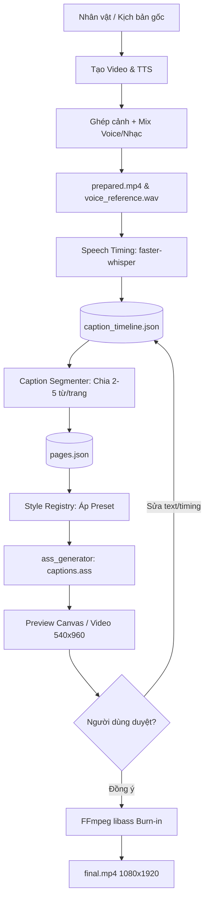

# KẾ HOẠCH TRIỂN KHAI PHỤ ĐỀ KIỂU CAPCUT BẰNG FFMPEG
> **Bản đặc tả thiết kế & quy chuẩn kỹ thuật cho hệ thống phụ đề tự động (Video Summarizer Pro)**  
> **Ngày lập:** 29/09/2026  
> **Phạm vi:** Phụ đề cơ bản, chữ đổi màu theo lời nói (Active Karaoke), chữ xuất hiện theo từ (Word Reveal), tô màu từ khóa (Keyword Highlight) bằng FFmpeg libass; độc lập hoàn toàn, không phụ thuộc tài nguyên/API CapCut.

---

## 0. TỔNG QUAN VÀ KẾT LUẬN KIẾN TRÚC
* **Tính khả thi:** Hoàn toàn làm được và độc lập 100%. Tool nhận video nhân vật/audio cuối, trích xuất mốc thời gian từng từ (Word Timestamps), sinh file phụ đề `.ass` chuẩn, sau đó gọi FFmpeg (`libass`) burn-in ra MP4 hoàn chỉnh.
* **Không phụ thuộc CapCut:** Không mở app CapCut, không auto-click, không gọi API nội bộ CapCut. "Kiểu CapCut" là định nghĩa về phong cách trực quan (Visual Style) do engine tự dựng.
* **Chiến lược phân tầng:**
  * **Tầng 1 (MVP ổn định - ASS + FFmpeg):** Câu trắng viền đen; đổi màu từ đang đọc (*Active-word only*); xuất hiện từng câu/từng từ; fade nhẹ; tô màu từ khóa; hộp nền bán trong suốt; tối ưu cho khung dọc TikTok/Reels/Shorts (9:16).
  * **Tầng 2 (Nâng cấp Animation từng từ):** Mỗi từ có tọa độ cố định được render layer riêng để pop, scale/bounce; hộp bo góc, glow. Ghép bằng FFmpeg alpha-overlay để triệt tiêu hiện tượng xô lệch bố cục (layout shifting).
* **Nguyên tắc dữ liệu:** Không dùng `.srt` làm nguồn duy nhất vì SRT không chứa timestamp từng từ. Nguồn sự thật duy nhất (Single Source of Truth) là `caption_timeline.json`.

---

## 1. MỤC TIÊU SẢN PHẨM & TIÊU CHÍ NGHIỆM THU

### 1.1. Mục tiêu sản phẩm
1. Video đầu ra đồng nhất 100% về nhận diện typography, kích thước, độ dày viền và vị trí hiển thị giữa các tập.
2. Caption bám sát âm thanh thực tế sau khi đã mix/cắt/ghép, bất kể nguồn là video gốc hay giọng AI (Edge-TTS / CapCut TTS).
3. Người dùng có thể chọn Preset, xem trước (Preview), tinh chỉnh timing/text và xuất bản tự động hàng loạt (Batch Processing).
4. Cơ chế thông báo lỗi minh bạch: font thiếu glyph tiếng Việt, FFmpeg thiếu libass, audio khó nghe đều báo rõ nguyên nhân.

### 1.2. Tiêu chí nghiệm thu bản MVP
* Video dọc chuẩn 1080×1920, 30 fps, tiếng Việt (30–60 giây) xử lý mượt mà từ đầu đến cuối.
* Có ít nhất 4 preset hoàn chỉnh:
  1. `BASIC_WHITE`: Trắng viền đen, hiển thị từng câu ngắn.
  2. `KARAOKE_YELLOW`: Cả câu hiện sẵn, riêng từ đang phát âm đổi sang vàng chanh (`#FFD300`), đọc xong quay về trắng.
  3. `KEYWORD_RED`: Tô màu nổi bật các từ khóa quan trọng của câu.
  4. `WORD_REVEAL`: Từ xuất hiện tuần tự theo nhịp đọc.
* Tiếng Việt hiển thị chuẩn dấu Unicode NFC, không bị lỗi font (tofu box).
* Vị trí nằm gọn trong vùng an toàn (Safe Zone), không bị giao diện TikTok (nút like, comment, share, caption dưới) che khuất.
* Cùng một timeline mốc từ, người dùng có thể đổi sang preset khác để render lại mà không cần chạy lại TTS hay Whisper.

---

## 2. QUY TRÌNH PIPELINE TỔNG THỂ



### Quy tắc cốt lõi:
* **Phụ đề bám theo audio sau cùng:** Nếu video có cắt ghép, đệm nhạc, đổi tốc độ thì mốc thời gian phụ đề phải được tính trên bản audio cuối (`voice_reference.wav` hoặc `prepared.mp4`). Mọi thay đổi về độ dài video đều làm mất hiệu lực (invalidate) timeline cũ.

---

## 3. CÔNG NGHỆ & QUYẾT ĐỊNH KỸ THUẬT

| Thành phần | Công nghệ chọn | Lý do & Giới hạn |
| :--- | :--- | :--- |
| **Phân tích Media** | `ffprobe` | Đọc duration, fps, resolution, sample_rate, stream index dạng JSON chuẩn. |
| **Chuẩn hóa Media** | `FFmpeg` | Quy chuẩn về video dọc 1080×1920, CFR 30 fps trước khi xử lý sub. |
| **Thời gian từng từ** | `faster-whisper` (word timestamps) | Nhận diện mốc `word.start`, `word.end` bám sát audio thực tế. |
| **Trung gian dữ liệu** | `caption_timeline.json` | Tách rời tầng nhận dạng và tầng thiết kế; đổi style không cần chạy lại ASR. |
| **Dàn trang (Segmenter)**| Python Module riêng | Đo pixel chữ bằng `Pillow ImageFont`, ngắt trang theo khoảng lặng (pause > 250ms). |
| **Render phụ đề MVP** | `ASS` qua `libass` trong FFmpeg | Đổi màu cực mượt, hỗ trợ Unicode tiếng Việt đầy đủ, render batch tốc độ cao. |
| **Render Nâng cao** | Alpha-overlay layer | Dùng cho hiệu ứng nảy từng từ (Word Bounce/Pop) để chống xô lệch layout. |
| **Mã hóa xuất xưởng** | H.264 + AAC (`-c:v libx264 -pix_fmt yuv420p`) | Tương thích tối đa với điện thoại, TikTok, Facebook Reels, YouTube Shorts. |

---

## 4. CẤU TRÚC DỮ LIỆU CHUẨN (SCHEMAS)

### 4.1. Manifest của Job (`job.json`)
```json
{
  "job_id": "tiktok_remix_20260929_001",
  "character_id": "coach_mike_v1",
  "media": {
    "prepared_video": "prepared.mp4",
    "voice_reference": "voice_final.wav",
    "duration_ms": 45200,
    "width": 1080,
    "height": 1920,
    "fps": 30.0
  },
  "caption": {
    "preset_id": "karaoke_yellow_v1",
    "language": "vi",
    "status": "ready_to_burn"
  }
}
```

### 4.2. Timeline từng từ (`caption_timeline.json`) — Single Source of Truth
```json
{
  "schema_version": 1,
  "timebase": "milliseconds_from_start",
  "language": "vi",
  "words": [
    {"id": "w001", "text": "Đừng", "start_ms": 420, "end_ms": 690, "confidence": 0.98},
    {"id": "w002", "text": "bao", "start_ms": 700, "end_ms": 880, "confidence": 0.95},
    {"id": "w003", "text": "giờ", "start_ms": 885, "end_ms": 1120, "confidence": 0.96},
    {"id": "w004", "text": "bỏ", "start_ms": 1150, "end_ms": 1380, "confidence": 0.92},
    {"id": "w005", "text": "cuộc.", "start_ms": 1390, "end_ms": 1820, "confidence": 0.99}
  ],
  "edits": []
}
```

### 4.3. Cấu trúc trang phụ đề (`pages.json`)
```json
{
  "page_id": "p001",
  "word_ids": ["w001", "w002", "w003", "w004", "w005"],
  "start_ms": 380,
  "end_ms": 1950,
  "lines": [
    ["w001", "w002", "w003"],
    ["w004", "w005"]
  ],
  "placement": "safe_bottom",
  "margin_v": 360
}
```

---

## 5. THUẬT TOÁN DÀN TRANG (SMART CAPTION SEGMENTER)

Không dùng số lượng ký tự hay chia đều thời gian. Thuật toán phân trang dựa trên 3 tiêu chí:
1. **Khoảng ngắt âm thanh (Acoustic Pause):** Khoảng cách giữa 2 từ > 250ms $\implies$ Ngắt trang mới.
2. **Dấu câu ngữ pháp:** Gặp `.`, `?`, `!`, `,` ưu tiên ngắt cụm.
3. **Độ rộng Pixel thực tế (Text Metrics):**
   * Sử dụng font chữ thật để đo: `text_width = font.getlength(line_text)`.
   * Giới hạn chiều rộng mỗi dòng $\le 900\text{ px}$ (đảm bảo chừa lề an toàn 90 px mỗi bên trên khung 1080 px).
   * Tối đa 2 dòng mỗi trang, tối đa 2–6 từ mỗi trang để tạo nhịp đọc dứt khoát kiểu CapCut.
4. **Pre-roll & Post-roll:** Thêm 40–80ms trước từ đầu tiên và 100–150ms sau từ cuối cùng để tránh chớp giật chữ.

---

## 6. ĐẶC TẢ 4 PRESET CAPCUT CỐT LÕI

### 6.1. Preset `BASIC_WHITE`
* Toàn bộ câu hiển thị màu trắng `#FFFFFF`, viền đen dày `#121212` (Outline 5px), bóng đổ nhẹ (Shadow 2px).
* Chữ cố định 1–2 dòng, ngắt trang ngắn gọn, không đổi màu. Dùng làm fallback khi cần độ ổn định tuyệt đối.

### 6.2. Preset `KARAOKE_YELLOW` (Active-Word Only)
* **Quy tắc hiển thị:** Cả câu xuất hiện sẵn màu trắng viền đen. Tại thời điểm phát âm từ thứ $i$, chỉ duy nhất từ đó đổi sang màu vàng chanh rực rỡ (`#FFD300`). Khi chuyển sang từ thứ $i+1$, từ thứ $i$ quay trở lại màu trắng.
* **Kỹ thuật thực thi:** Không dùng tag `\k` (vì `\k` giữ nguyên màu đến hết câu). Thay vào đó, sinh các dòng Dialogue ASS độc lập theo từng mốc từ active, giữ nguyên vị trí cả câu và chỉ bọc mã đổi màu quanh từ active:
  ```text
  Dialogue: 0,0:00:00.42,0:00:00.69,Default,,0,0,0,,{\c&H00D3FF&}Đừng{\c&HFFFFFF&} bao giờ bỏ cuộc.
  Dialogue: 0,0:00:00.70,0:00:00.88,Default,,0,0,0,,Đừng {\c&H00D3FF&}bao{\c&HFFFFFF&} giờ bỏ cuộc.
  Dialogue: 0,0:00:00.88,0:00:01.12,Default,,0,0,0,,Đừng bao {\c&H00D3FF&}giờ{\c&HFFFFFF&} bỏ cuộc.
  ```
  *(Lưu ý: Mã màu ASS có thứ tự BGR: `&H00D3FF&` là Vàng)*.

### 6.3. Preset `KEYWORD_RED`
* Câu nền trắng viền đen. Các từ khóa quan trọng (định nghĩa theo danh sách hoặc trích xuất tự động) sẽ được bọc màu Đỏ rực (`#FF2A2A` $\to$ ASS `&H2A2AFF&`) trong suốt thời gian trang hiển thị.

### 6.4. Preset `WORD_REVEAL`
* Các từ lần lượt xuất hiện theo từng mốc phát âm. Chữ được cố định lề để không bị nhảy ngang khi thêm từ mới.

---

## 7. QUY TRÌNH BURN-IN BẰNG FFMPEG

Lệnh burn-in chuẩn xác cho Windows (đã xử lý escape path và thư mục có dấu cách):
```bash
ffmpeg -hide_banner -y -i "prepared.mp4" -vf "ass='captions.ass'" -c:v libx264 -preset medium -crf 18 -pix_fmt yuv420p -c:a aac -b:a 192k -movflags +faststart "final.mp4"
```
* **Bảo vệ Vùng An Toàn (Safe Zone):**
  * `MarginV = 360` (cách đáy 360px trên khung 1920px để tránh thanh mô tả và thanh trượt TikTok).
  * `MarginL = 90`, `MarginR = 90` (tránh tràn mép).

---

## 8. LỘ TRÌNH TRIỂN KHAI THEO TỪNG GIAI ĐOẠN

* **Giai đoạn 1 (MVP Cốt lõi — 100% Ổn định):**
  1. Module trích xuất audio và chạy `faster-whisper` lưu `caption_timeline.json`.
  2. Module `CaptionSegmenter` chia câu 2–5 từ/trang theo khoảng lặng và dấu câu.
  3. Module `ASSGenerator` hỗ trợ `BASIC_WHITE` và `KARAOKE_YELLOW` (Active-Word Only).
  4. FFmpeg Burn-in và kiểm định chất lượng (QC Report).
* **Giai đoạn 2 (Tích hợp UI & Preset Mở rộng):**
  1. Tích hợp lựa chọn Preset trực tiếp vào màn hình Studio của Tool.
  2. Bổ sung `KEYWORD_RED` và `BOX_SQUARE` (hộp nền mờ).
  3. Preview trực tiếp khung 9:16 trên Qt Canvas trước khi bấm Render.
* **Giai đoạn 3 (Animation Nâng cao - Word Pop/Bounce):**
  1. Tính toán bounding box tuyệt đối của từng từ.
  2. Dựng overlay layer riêng bằng FFmpeg filter để phóng to nảy từ mà không làm xô lệch dòng chữ.

---

## 9. QUY TẮC PHÒNG NGỪA CÁC LỖI KỸ THUẬT KINH ĐIỂN
1. **Chữ vàng bị biến thành màu xanh lam:** Do ASS dùng hệ màu `&HAABBGGRR` (BGR) thay vì `RGB`. Luôn có hàm convert màu chuẩn.
2. **Dòng chữ bị giật sang phải khi đổi màu:** Luôn giữ nguyên chuỗi text cả câu và cùng một kiểu font metrics, chỉ bọc tag màu `{\c}` nội dòng, không thay đổi font size hay scale cục bộ trên ASS thuần.
3. **Chữ có dấu tiếng Việt bị ô vuông:** Chỉ dùng font hệ thống có đầy đủ glyph Unicode tiếng Việt (Segoe UI Black, Arial Bold, Montserrat Black, Noto Sans).
4. **Lỗi đường dẫn Windows có dấu cách:** Chạy FFmpeg qua danh sách tham số `subprocess.run([...])`, không ghép chuỗi shell thô.
