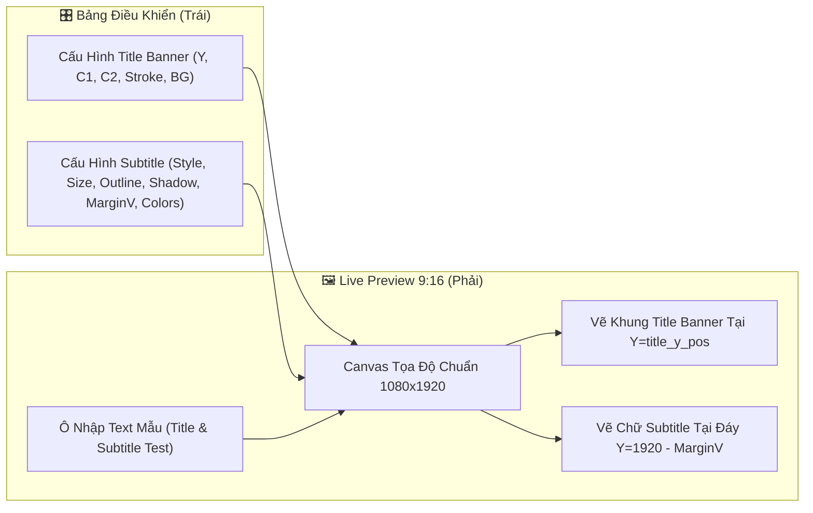
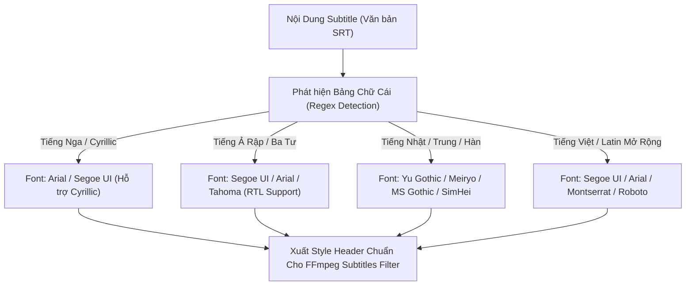

# 🏷️ THIẾT KẾ KIẾN TRÚC & KỸ THUẬT: TITLE & SUBTITLE STUDIO (KÈM BẢNG LIVE PREVIEW 9:16)

> **Mục tiêu**: Cung cấp tài liệu thiết kế kỹ thuật, giải thuật toán học và kiến trúc UI/UX toàn diện 100% cho hệ thống **Title & Subtitle Studio** (Tiêu đề Banner 2 dòng & Phụ đề đa phong cách). Đặc biệt nâng cấp kiến trúc **2 Bảng song song (Left Controls + Right Live 9:16 Preview)** mô phỏng trực quan chuẩn xác vị trí, cỡ chữ, viền, bóng và màu sắc thực tế.

---

## 📑 MỤC LỤC
1. [Kiến Trúc Tổng Thể 2 Bảng (Left Controls + Right 9:16 Canvas)](#1-kiến-trúc-tổng-thể-2-bảng)
2. [Chi Tiết Cấu Hình Tiêu Đề (Title Banner Engine)](#2-chi-tiết-cấu-hình-tiêu-đề-title-banner-engine)
3. [Chi Tiết Cấu Hình Phụ Đề (Subtitle Style Engine)](#3-chi-tiết-cấu-hình-phụ-đề-subtitle-style-engine)
4. [Hệ Thống Đổi Màu Kép: Web Hex (#RRGGBB) vs ASS Hex (&HBBGGRR&)](#4-hệ-thống-đổi-màu-kép)
5. [Cơ Chế Font Đa Quốc Gia & Chống Lỗi Font [] (FontManager)](#5-cơ-chế-font-đa-quốc-gia--chống-lỗi-font-)
6. [Thuật Toán Bảng Right Live Preview 9:16 (Mô Phỏng Trực Quan)](#6-thuật-toán-bảng-right-live-preview-916)
7. [Mã Nguồn Mẫu Hoàn Chỉnh Cho Popup Studio (Tkinter Canvas)](#7-mã-nguồn-mẫu-hoàn-chỉnh-cho-popup-studio)
8. [Tích Hợp Vào Pipeline FFmpeg & PIL Render](#8-tích-hợp-vào-pipeline-ffmpeg--pil-render)

---

## 1. KIẾN TRÚC TỔNG THỂ 2 BẢNG

Studio được bố trí thành 2 bảng đối xứng (tương tự như Studio Cắt Video và Bảng Màu Look):
- **Bảng Trái (Left Panel - Bảng Điều Khiển)**:
  - **Nhóm Tiêu Đề (Title Banner)**: Checkbox bật/tắt, Spinbox Tọa độ Y (lên/xuống), 4 ô màu (Dòng 1, Dòng 2, Viền, Nền Banner).
  - **Nhóm Phụ Đề (Subtitle Style)**: Checkbox bật/tắt, 3 Radiobutton kiểu phụ đề (Cổ điển, Thanh mảnh TikTok, Tiêu chuẩn), Spinbox Cỡ chữ, Độ dày viền, Bóng mờ 3D (Shadow), Lề đáy (MarginV), 2 ô màu ASS (Màu chữ, Màu viền).
- **Bảng Phải (Right Panel - Khung Xem Trước 9:16)**:
  - Khung Canvas nền tối mô phỏng màn hình điện thoại $1080 \times 1920$ (co giãn theo tỉ lệ 9:16).
  - **2 Ô Nhập Mẫu (Sample Inputs)**: Cho phép gõ thử câu Tiêu Đề và câu Phụ Đề thực tế để xem ngay.
  - **Mô Phỏng Title Banner Trực Quan**: Vẽ đúng bo góc, màu nền, viền, tách 2 dòng với màu sắc riêng biệt và căn chuẩn theo `title_y_pos`.
  - **Mô Phỏng Subtitle Trực Quan**: Vẽ chữ sắc nét có viền và bóng mờ 3D theo đúng `sub_margin_v`, `sub_size`, `sub_color`, `sub_outline_color`.



---

## 2. CHI TIẾT CẤU HÌNH TIÊU ĐỀ (TITLE BANNER ENGINE)

### 2.1. Cấu Trúc Thông Số Config
```json
{
  "enable_title": true,
  "title_y_pos": 320,
  "title_color1": "#000000",
  "title_color2": "#FF0000",
  "title_outline_color": "none",
  "title_bg_color": "#FFFFFF"
}
```

### 2.2. Giải Thuật Vẽ Dynamic Banner Bằng PIL (Pillow)
1. **Tách 2 dòng tự động (`_layout_banner_title`)**:
   - Nếu tiêu đề ngắn $\le 30$ ký tự $\to$ Giữ 1 dòng.
   - Nếu dài $\to$ Tự động tìm khoảng trắng ở giữa để tách làm 2 dòng cân đối nhất.
2. **Tính toán kích thước hộp bao (Bounding Box Calculation)**:
   - Sử dụng `font.getbbox(text, stroke_width=...)` để lấy kích thước pixel thật.
   - Chiều rộng banner: $W_{\text{banner}} = \max(W_{\text{line1}}, W_{\text{line2}}) + 2 \times \text{PAD\_X}$ ($\text{PAD\_X} = 36\text{px}$).
   - Chiều cao banner: $H_{\text{banner}} = H_{\text{line1}} + H_{\text{line2}} + \text{spacing} + 2 \times \text{PAD\_Y}$ ($\text{PAD\_Y} = 24\text{px}$).
3. **Vẽ nền bo góc & Chữ:**
   - `draw.rounded_rectangle([(0,0), (bw, bh)], radius=24, fill=bg_color)`
   - Căn giữa dòng 1: $X_1 = \frac{W_{\text{banner}} - W_1}{2}$, tô màu `title_color1`.
   - Căn giữa dòng 2: $X_2 = \frac{W_{\text{banner}} - W_2}{2}$, tô màu `title_color2`.
4. **Tọa độ đặt lên video:**
   - $X = \frac{1080 - W_{\text{banner}}}{2}$ (Luôn căn chính giữa chiều ngang).
   - $Y = \text{title\_y\_pos}$ (Mặc định 260px đến 320px).

---

## 3. CHI TIẾT CẤU HÌNH PHỤ ĐỀ (SUBTITLE STYLE ENGINE)

### 3.1. Ba Phong Cách Phụ Đề Điện Ảnh (Style Presets)
Hệ thống thiết lập sẵn 3 preset tối ưu cho các nền tảng video ngắn (TikTok, YouTube Shorts, Reels):

| Preset | Kiểu Hiển Thị | Cỡ Chữ (`sub_size`) | Độ Dày Viền (`outline`) | Bóng 3D (`shadow`) | Lề Đáy (`sub_margin_v`) | Tính Chất Chữ |
|:---|:---|:---:|:---:|:---:|:---:|:---|
| **🏛️ Cổ Điển (Classic)** | In hoa to bản, viền đen dày | `26` | `3` | `0` | `80` | `uppercase = True`, Chữ in hoa toàn bộ, nổi bật trên mọi nền |
| **✨ Thanh Mảnh (TikTok Slim)** | Nét mảnh thanh lịch (Giống kênh Top 1) | `16` | `2` | `1` | `100` | Chữ thường tự nhiên, có đổ bóng nhẹ 3D tách lớp |
| **📺 Tiêu Chuẩn (Standard)** | Cân đối hài hòa | `21` | `2` | `0` | `90` | Dễ đọc, kích thước trung bình |

---

## 4. HỆ THỐNG ĐỔI MÀU KÉP: WEB HEX VS ASS HEX

Một trong những lỗi kinh điển khi lập trình video tóm tắt là sự nhầm lẫn giữa mã màu **RGB chuẩn Web** và **BGR chuẩn phụ đề ASS của FFmpeg**:

### 4.1. Quy Tắc Định Dạng
- **Tiêu đề (Title Banner - PIL):** Sử dụng hệ màu Web Hex: `#RRGGBB` (Ví dụ: `#000000` = Đen, `#FF0000` = Đỏ, `#FFFFFF` = Trắng).
- **Phụ đề (Subtitle - FFmpeg ASS/SRT):** Sử dụng chuẩn ASS SubStation Alpha: `&HBBGGRR&` (Đảo ngược kênh Đỏ và Xanh Dương).
  - Màu trắng: `&HFFFFFF&`
  - Màu đen: `&H000000&`
  - Màu vàng chanh: Web là `#FFFF00` $\to$ ASS là `&H00FFFF&`
  - Màu xanh dương: Web là `#0000FF` $\to$ ASS là `&HFF0000&`

### 4.2. Thuật Toán Chuyển Đổi Tự Động Trong Color Picker
```python
def hex_to_ass(hex_color: str) -> str:
    """Chuyển #RRGGBB sang &HBBGGRR&"""
    clean = hex_color.lstrip('#')
    r, g, b = clean[0:2], clean[2:4], clean[4:6]
    return f"&H{b}{g}{r}&".upper()

def ass_to_hex(ass_color: str) -> str:
    """Chuyển &HBBGGRR& sang #RRGGBB để hiển thị lên UI Tkinter"""
    clean = ass_color.replace("&H", "").replace("&", "")
    if len(clean) == 6:
        b, g, r = clean[0:2], clean[2:4], clean[4:6]
        return f"#{r}{g}{b}"
    return "#FFFFFF"
```

---

## 5. CƠ CHẾ FONT ĐA QUỐC GIA & CHỐNG LỖI FONT [] (`FontManager`)

Hệ thống tích hợp `FontManager` để tự động quét ngôn ngữ trong tệp phụ đề (hoặc audio transcription) và chỉ định đúng font hệ thống hỗ trợ đầy đủ Unicode ký tự đặc biệt:



---

## 6. THUẬT TOÁN BẢNG RIGHT LIVE PREVIEW 9:16 (MÔ PHỎNG TRỰC QUAN)

### 6.1. Quy Đổi Tọa Độ Video $1080 \times 1920 \to$ Canvas
Giả sử Canvas xem trước có kích thước $W_{\text{canvas}}, H_{\text{canvas}}$:
1. Tính hệ số tỉ lệ fit vừa vặn:
   $$\text{scale} = \min\left(\frac{W_{\text{canvas}} - 20}{1080}, \frac{H_{\text{canvas}} - 20}{1920}\right)$$
   $$W_{\text{disp}} = 1080 \times \text{scale}, \quad H_{\text{disp}} = 1920 \times \text{scale}$$
   $$X_{\text{offset}} = \frac{W_{\text{canvas}} - W_{\text{disp}}}{2}, \quad Y_{\text{offset}} = \frac{H_{\text{canvas}} - H_{\text{disp}}}{2}$$

2. **Vẽ Khung Mô Phỏng Title Banner:**
   - Chiều rộng banner canvas: $W_{\text{bc}} = W_{\text{banner\_real}} \times \text{scale}$
   - Chiều cao banner canvas: $H_{\text{bc}} = H_{\text{banner\_real}} \times \text{scale}$
   - Tọa độ Canvas:
     $$X_{\text{center}} = X_{\text{offset}} + \frac{W_{\text{disp}}}{2}$$
     $$Y_{\text{canvas}} = Y_{\text{offset}} + \text{title\_y\_pos} \times \text{scale}$$
   - Vẽ hình chữ nhật bo góc với màu `title_bg_color` và vẽ 2 dòng chữ mẫu với màu `title_color1`, `title_color2`.

3. **Vẽ Khung Mô Phỏng Subtitle:**
   - Kích thước chữ trên canvas: $\text{size}_{\text{canvas}} = \max(8, \text{int}(\text{sub\_size} \times 1.8 \times \text{scale}))$
   - Tọa độ Y trên Canvas:
     $$Y_{\text{sub}} = Y_{\text{offset}} + (1920 - \text{sub\_margin\_v}) \times \text{scale}$$
   - **Vẽ Bóng Đổ 3D:** Nếu `sub_shadow > 0`, vẽ bóng mờ lệch $(+1, +1)$ màu đen bán trong suốt.
   - **Vẽ Viền Chữ (Outline):** Vẽ 8 hướng $(\pm 1, \pm 1)$ với màu `sub_outline_color`.
   - **Vẽ Chữ Chính:** Vẽ chữ với màu `sub_color` (đã convert qua RGB).

---

## 7. MÃ NGUỒN MẪU HOÀN CHỈNH CHO POPUP STUDIO

Dưới đây là mã nguồn Tkinter hoàn chỉnh có sẵn 2 bảng (Left Controls + Right 9:16 Live Preview):

```python
import tkinter as tk
from tkinter import ttk, colorchooser, messagebox
from PIL import Image, ImageTk, ImageDraw, ImageFont

def open_title_sub_studio_with_preview(parent, config, on_save_callback=None):
    popup = tk.Toplevel(parent)
    popup.title("Title & Subtitle Studio (Live 9:16 Interactive Preview)")
    popup.geometry("1180x820")
    popup.minsize(980, 680)
    popup.transient(parent)

    # 1. BẢNG TRÁI: BỘ ĐIỀU KHIỂN
    left_frame = ttk.LabelFrame(popup, text=" ⚙️ Điều Khiển Thông Số & Màu Sắc ", padding=10)
    left_frame.pack(side=tk.LEFT, fill=tk.BOTH, expand=False, padx=10, pady=10)

    # 2. BẢNG PHẢI: LIVE PREVIEW 9:16
    right_frame = ttk.LabelFrame(popup, text=" 🖼️ Khung Xem Trước 9:16 Trực Quan ", padding=10)
    right_frame.pack(side=tk.RIGHT, fill=tk.BOTH, expand=True, padx=10, pady=10)

    # Canvas Preview
    preview_canvas = tk.Canvas(right_frame, bg="#121214", highlightthickness=0)
    preview_canvas.pack(fill=tk.BOTH, expand=True, pady=(0, 8))

    # Ô nhập text test thử nghiệm
    test_bar = ttk.Frame(right_frame)
    test_bar.pack(fill=tk.X)
    ttk.Label(test_bar, text="Title test:").grid(row=0, column=0, sticky=tk.W)
    title_test_ent = ttk.Entry(test_bar, width=32)
    title_test_ent.insert(0, "TIÊU ĐỀ DÒNG 1\nTIÊU ĐỀ DÒNG 2")
    title_test_ent.grid(row=0, column=1, sticky=tk.EW, padx=5, pady=2)

    ttk.Label(test_bar, text="Sub test:").grid(row=1, column=0, sticky=tk.W)
    sub_test_ent = ttk.Entry(test_bar, width=32)
    sub_test_ent.insert(0, "Đây là phụ đề mẫu đang hiển thị thử nghiệm...")
    sub_test_ent.grid(row=1, column=1, sticky=tk.EW, padx=5, pady=2)

    # State variables
    enable_title_var = tk.BooleanVar(value=bool(config.get("enable_title", True)))
    enable_sub_var = tk.BooleanVar(value=bool(config.get("enable_sub", True)))
    sub_style_var = tk.StringVar(value=config.get("sub_style_type", "tiktok_slim"))

    # Hàm vẽ lại toàn bộ Preview Canvas 9:16
    def redraw_preview(event=None):
        cw = preview_canvas.winfo_width()
        ch = preview_canvas.winfo_height()
        if cw < 50 or ch < 50:
            cw, ch = 480, 700
        preview_canvas.delete("all")

        # Khung 9:16
        target_ratio = 1080.0 / 1920.0
        if cw / float(ch) > target_ratio:
            disp_h = max(100, int(ch - 24))
            disp_w = max(56, int(disp_h * target_ratio))
        else:
            disp_w = max(56, int(cw - 24))
            disp_h = max(100, int(disp_w / target_ratio))

        ox = int((cw - disp_w) / 2)
        oy = int((ch - disp_h) / 2)
        scale = disp_w / 1080.0

        # Nền video giả lập
        preview_canvas.create_rectangle(ox, oy, ox + disp_w, oy + disp_h, fill="#222228", outline="#44444a", width=2)

        # 1. Vẽ Title Banner Nếu Bật
        if enable_title_var.get():
            ty = int(title_y_spin.get() or 320)
            t_canvas_y = oy + int(ty * scale)
            bg_col = t_bg_ent.get().strip() or "#FFFFFF"
            c1_col = t_c1_ent.get().strip() or "#000000"
            c2_col = t_c2_ent.get().strip() or "#FF0000"
            
            # Giả lập hộp Banner
            bw_c = int(disp_w * 0.82)
            bh_c = int(60 * scale * 2.2)
            bx1 = ox + int((disp_w - bw_c) / 2)
            by1 = t_canvas_y
            bx2 = bx1 + bw_c
            by2 = by1 + bh_c
            
            preview_canvas.create_rectangle(bx1, by1, bx2, by2, fill=bg_col, outline="#333333", width=1)
            t_lines = title_test_ent.get().splitlines()
            l1 = t_lines[0] if len(t_lines) > 0 else "TITLE SAMPLE"
            l2 = t_lines[1] if len(t_lines) > 1 else ""
            
            f_size = max(8, int(22 * scale * 1.8))
            if l2:
                preview_canvas.create_text((bx1 + bx2)/2, by1 + bh_c * 0.32, text=l1, fill=c1_col, font=("Segoe UI", f_size, "bold"))
                preview_canvas.create_text((bx1 + bx2)/2, by1 + bh_c * 0.72, text=l2, fill=c2_col, font=("Segoe UI", f_size, "bold"))
            else:
                preview_canvas.create_text((bx1 + bx2)/2, (by1 + by2)/2, text=l1, fill=c1_col, font=("Segoe UI", f_size, "bold"))

        # 2. Vẽ Subtitle Nếu Bật
        if enable_sub_var.get():
            m_v = int(sub_margin_spin.get() or 100)
            s_canvas_y = oy + int((1920 - m_v) * scale)
            sub_text = sub_test_ent.get().strip()
            if sub_style_var.get() == "classic":
                sub_text = sub_text.upper()
                
            raw_c = sub_c_ent.get().strip()
            sub_hex = ass_to_hex(raw_c) if raw_c.startswith("&H") else (raw_c or "#FFFFFF")
            raw_ol = sub_ol_ent.get().strip()
            ol_hex = ass_to_hex(raw_ol) if raw_ol.startswith("&H") else (raw_ol or "#000000")
            
            s_size = max(8, int(int(sub_size_spin.get() or 16) * 1.8 * scale))
            s_font = ("Segoe UI", s_size, "bold")
            cx_pos = ox + int(disp_w / 2)
            
            # Vẽ bóng & viền
            if int(sub_shadow_spin.get() or 0) > 0:
                preview_canvas.create_text(cx_pos + 2, s_canvas_y + 2, text=sub_text, fill="#000000", font=s_font)
            # Outline
            for dx, dy in [(-1,0),(1,0),(0,-1),(0,1),(-1,-1),(1,1),(-1,1),(1,-1)]:
                preview_canvas.create_text(cx_pos + dx, s_canvas_y + dy, text=sub_text, fill=ol_hex, font=s_font)
            # Main Text
            preview_canvas.create_text(cx_pos, s_canvas_y, text=sub_text, fill=sub_hex, font=s_font)

    preview_canvas.bind("<Configure>", redraw_preview)
    title_test_ent.bind("<KeyRelease>", redraw_preview)
    sub_test_ent.bind("<KeyRelease>", redraw_preview)
    
    # Trigger redraw on any UI change...
```

---

## 8. TÍCH HỢP VÀO PIPELINE FFMPEG & PIL RENDER

Khi xuất video hoàn chỉnh trong `editor_processor.py`:
1. **Title Banner:** Sinh file ảnh PNG trong suốt `title_banner_final.png` và đè lên video qua filter:
   `[v_in][banner_png]overlay=x=(W-w)/2:y={title_y_pos}[v_titled]`
2. **Subtitle ASS/SRT:** Nhúng phụ đề với style chính xác:
   `[v_titled]subtitles='sub.srt':force_style='Fontname=Segoe UI,FontSize={sub_size},PrimaryColour={sub_color},OutlineColour={sub_outline_color},Outline={sub_outline},Shadow={sub_shadow},MarginV={sub_margin_v}'[vout]`

---

## 💡 HƯỚNG DẪN BÀN GIAO CHO PROJECT V32_PRO

1. Copy toàn bộ mã nguồn `font_manager.py` vào thư mục gốc `v32_pro`.
2. Áp dụng kiến trúc 2 bảng đối xứng (Left Controls + Right 9:16 Canvas Live Preview) vào popup `open_title_sub_studio_popup`.
3. Đảm bảo hỗ trợ chuyển đổi mượt mà giữa màu Web Hex (`#RRGGBB`) cho Title và ASS Hex (`&HBBGGRR&`) cho Subtitle.
